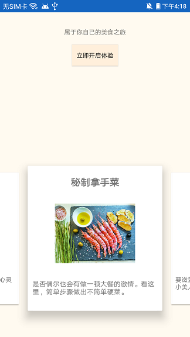
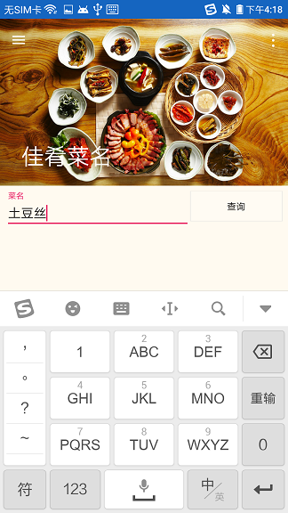

# FamilyMenu
自己设计并实现的菜谱查询功能App，可以称之为家庭菜谱。

## 背景
之前做的App一直使用udp/tcp的通讯方式，但http协议依然很普遍且更合理，此项目包含http通讯及解析复杂格式json数据。

## 功能描述
* App引导
* 按菜名查询
* 按标签查询
* 设置个人信息

## 技术栈
* 原生安卓
* http
* 聚合数据

## 功能截图

## 特此声明

代码里用到了`聚合数据`申请的菜谱数据库编号，免费申请有1000次试用机会，现在次数已用完导致app搜不到菜谱，代码本身是没有问题的。

大家可以自己去申请一个1000次试用，替换掉代码里的聚合数据的编号即可。
